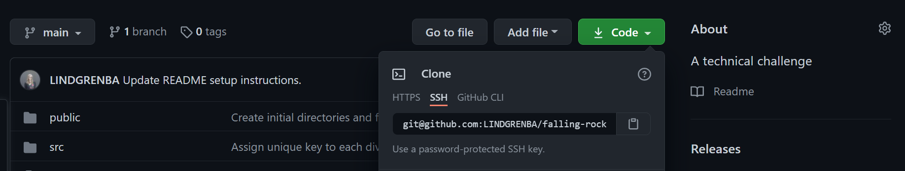

# Description :
This project is a technical challenge entitled 'Falling Rocks', created for the Phylos interview process.

# Process / Approach :

### Initial Setup
- [X] Create an initial React app 
- [X] Add a react hook to hold state 
- [X] Create a 2x2 grid 
- [X] Add an array to store the possible elements (destructure array?) or variables to store the elements 
- [X] Add a button 
- [X] On the button click, render a hard coded `world` with elements into the grid

### Taking Note of Elements
- Write an algorithm to check the elements inside of the 2D world and update appropriately
- [X] Write a function to checks which elements exists in the squares at the bottom of the grid
- [X] Update the function to also check which element exists in the squares "above" the bottom squares of the grid

### Updating the 2D-World / Grid
- Begin to update each square of the grid based on which element currently exists within each square and the square above it
- [ ] Expand the function so that it checks not only the second row up from the bottom, but every row from the bottom up (look for pre-existing algorithms to dynamically update a grid)

```
#### Notes for Updating :
Consider using nested arrays to represent the 2D-World (see item #3 in Resources / Research section below)
```


# Bugs / Issues :

| Issue & Message | Resolved? | Solution |
| --------- | ---------- | ---------- | 
| `Each child in a list should have a unique "key" prop.` | In Progress | Used the (uuid)[https://www.npmjs.com/package/react-uuid] to generate unique identifiers  |


# Future Updates :

* Render random 2D-World dynamically / programmatically 
* Abstract out algorithm to update grid into separate file


# Testing Steps / QA Criteria :

### Requirements :
 To run this application, you will need `npm` installed on your computer. To check if you have Node.js and npm installed, you can enter `node -v` and `npm -v` in your terminal. If they are installed, you should see the software versioning number printed to your terminal. 
```
 Example:
  v10.15.1
``` 

 If you do not have Node.js and npm installed, you can follow along with the [Downloading and installing Node.js and npm](https://docs.npmjs.com/downloading-and-installing-node-js-and-npm) guide to complete the installation process. Once Node.js and npm are installed, follow the steps below to run the project locally. 

1. From your terminal, pull down this project using the command `git pull` + repo-link (found by selecting the green dropdown in the upper right corner of the github repo). 

2. Once you have the project locally, open it inside of a code editor such as `Atom` or `Visual Studio Code`.
3. To install the necessary dependencies, enter the command `npm install` into your terminal.
4. Then enter `npm start`
5. After entering `npm start`, the project should open in your browser. This may take a a few seconds. 

If the project does not open in your browser, try opening a new browser tab and navigating to `localhost:3000` (note: the number after `localhost:` may be different if you have other projects running at the same time - you can check the number in your terminal).
 
If the project does not appear in the browser, reviewthe previous steps and confirm that you have Node.jsand npm installed on your device.     


# Resources / Research :

1. [Code Tetris: JavaScript Tutorial for Beginners](https://youtu.be/rAUn1Lom6dw)
2. [setTimeout in React Components Using Hooks](https://upmostly.com/tutorials/settimeout-in-react-components-using-hooks)
3. [2D Arrays in JavaScript](https://youtu.be/OTNpiLUSiB4)    
<br/>


# Getting Started with Create React App

This project was bootstrapped with [Create React App](https://github.com/facebook/create-react-app).

## Available Scripts

In the project directory, you can run:

### `npm start`

Runs the app in the development mode.\
Open [http://localhost:3000](http://localhost:3000) to view it in the browser.

The page will reload if you make edits.\
You will also see any lint errors in the console.

### `npm test`

Launches the test runner in the interactive watch mode.\
See the section about [running tests](https://facebook.github.io/create-react-app/docs/running-tests) for more information.

### `npm run build`

Builds the app for production to the `build` folder.\
It correctly bundles React in production mode and optimizes the build for the best performance.

The build is minified and the filenames include the hashes.\
Your app is ready to be deployed!

See the section about [deployment](https://facebook.github.io/create-react-app/docs/deployment) for more information.

### `npm run eject`

**Note: this is a one-way operation. Once you `eject`, you can’t go back!**

If you aren’t satisfied with the build tool and configuration choices, you can `eject` at any time. This command will remove the single build dependency from your project.

Instead, it will copy all the configuration files and the transitive dependencies (webpack, Babel, ESLint, etc) right into your project so you have full control over them. All of the commands except `eject` will still work, but they will point to the copied scripts so you can tweak them. At this point you’re on your own.

You don’t have to ever use `eject`. The curated feature set is suitable for small and middle deployments, and you shouldn’t feel obligated to use this feature. However we understand that this tool wouldn’t be useful if you couldn’t customize it when you are ready for it.

## Learn More

You can learn more in the [Create React App documentation](https://facebook.github.io/create-react-app/docs/getting-started).

To learn React, check out the [React documentation](https://reactjs.org/).

### Code Splitting

This section has moved here: [https://facebook.github.io/create-react-app/docs/code-splitting](https://facebook.github.io/create-react-app/docs/code-splitting)

### Analyzing the Bundle Size

This section has moved here: [https://facebook.github.io/create-react-app/docs/analyzing-the-bundle-size](https://facebook.github.io/create-react-app/docs/analyzing-the-bundle-size)

### Making a Progressive Web App

This section has moved here: [https://facebook.github.io/create-react-app/docs/making-a-progressive-web-app](https://facebook.github.io/create-react-app/docs/making-a-progressive-web-app)

### Advanced Configuration

This section has moved here: [https://facebook.github.io/create-react-app/docs/advanced-configuration](https://facebook.github.io/create-react-app/docs/advanced-configuration)

### Deployment

This section has moved here: [https://facebook.github.io/create-react-app/docs/deployment](https://facebook.github.io/create-react-app/docs/deployment)

### `npm run build` fails to minify

This section has moved here: [https://facebook.github.io/create-react-app/docs/troubleshooting#npm-run-build-fails-to-minify](https://facebook.github.io/create-react-app/docs/troubleshooting#npm-run-build-fails-to-minify)
